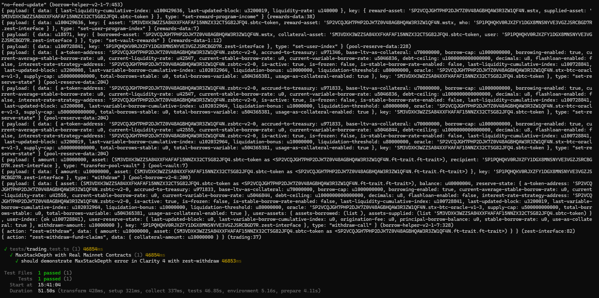
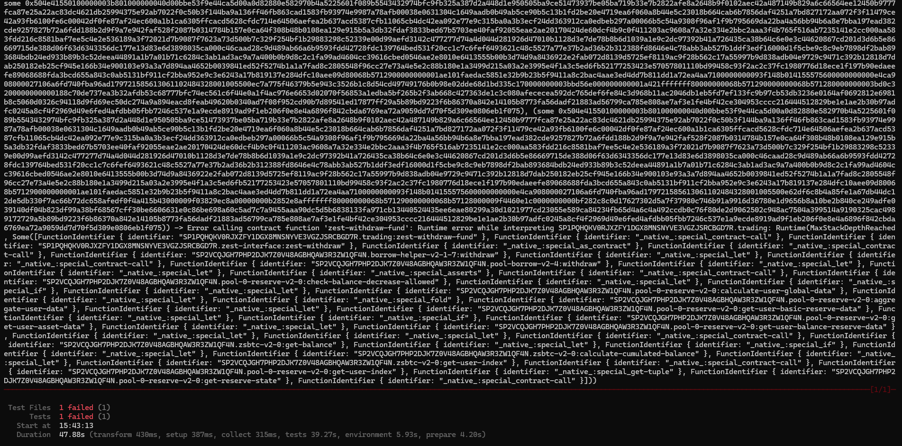

# Clarity 4 MaxStackDepth Reproduction

This repo contains minimal contracts that reproduces the Clarity 4 `MaxStackDepthReached` error. It mirrors the production hBTC withdraw flow so you can observe, profile, and test stack depth error.

---

## Architecture Overview

| Component | File | Purpose |
| --- | --- | --- |
| Reserve | `contracts/reserve.clar` | Holds assets and performs transfers. |
| Interface | `contracts/zest-interface.clar` | Wraps Zest borrows/withdrawals, bridges oracle inputs, contains the problematic nested calls. |
| Trading | `contracts/trading.clar` | Public entry point that orchestrates withdrawals and feeds data/claims downstream. |
| Tests | `tests/trading.test.ts` | Runs the live-flow scenario inside Clarinet Simnet with real mainnet contracts. |

---

## Prerequisites
- Node ≥ 18 and npm ≥ 9
- Clarinet ≥ 3.9.2
- Hiro API key (free) to avoid rate limits when downloading contracts: `export HIRO_API_KEY=your_key`
- Internet access

---

## Setup
```bash
git clone https://github.com/Dulb26/clarity4-max-stack-depth-poc.git
cd clarity4-max-stack-depth-poc

npm install
```

---

## Running the Suite

| Command | What it does |
| --- | --- |
| `npm test` | Runs the Clarinet-powered Vitest suite once (expected to surface `MaxStackDepthReached` on the withdraw call). |
| `npm run test:report` | Same as above plus coverage/costs output for quick profiling. |
| `npm run test:watch` | Watches `tests/**/*.ts` and `contracts/**/*.clar`, rerunning the suite automatically. |

> Tip: if you see `429 Too Many Requests`, set `HIRO_API_KEY` and retry after ~60s.

### Expected Output

Clarity 3 - Test Pass


Clarity 4 - Test Fail


---

## Clarity 3 Reference Branch

Check out the `clarity-3` branch in this repo. It contains the same contracts updated for Clarity 3 syntax, and the withdraw flow succeeds there.


## Repository Layout
```
.
├── Clarinet.toml
├── contracts/
│   ├── reserve.clar
│   ├── trading.clar
│   ├── zest-interface.clar
│   ├── traits/
│   │   ├── vault-trait.clar
│   │   └── zest-borrow-helper-trait-v1.clar
│   └── oracle/
│       ├── pyth-*.clar
│       └── wormhole/
│           └── wormhole-core-v4.clar
├── deployments/default.simnet-plan.yaml
├── settings/
├── tests/
│   ├── helper/
│   │   ├── init.ts
│   │   ├── initPyth.ts
│   │   └── zestPoolParser.ts
│   ├── settings/
│   │   ├── constants.ts
│   │   └── contracts.ts
│   └── trading.test.ts
```

---
